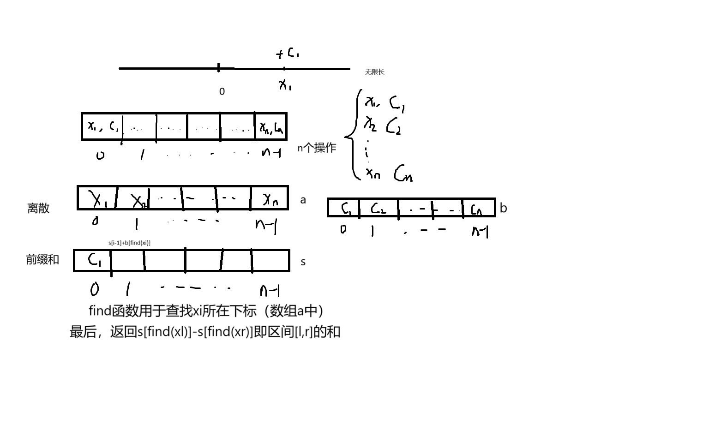

# 基础算法：离散化
1. 
	- #### 对于数据个数较少但分布及其不均的可以采用离散化存储数据
	- #### 假设有存在2e9的区间范围，有1e5的数据需要插入到这个区间内
	- #### 那么只需要开设多个1e5+x(防爆)的数组即可，分别存储插入位置和插入值,即把插入位置（总之就是位置离散化，后续对位置有要求也可以插入到这个离散化数组）离散化
	- #### 例如，当1e5的数据插入完成后，需要求[l,r]区间内的和，那么把l，r也均离散化插入（这里用个pair数组再用存一下）那个离散数组，然后排序去重，对之前的数据，我们开个新数组，在离散数组中查找（二分）插入位置的下x标，在a[x]加入插入数据，这样就完成了存储。为了求和， 要处理数组前缀和，开一个数组s，下标要和a对应（即如果a是从1开始那么s也要从1开始），s[i] = s[i-1] + a[i];这样就完成了区间前缀和操作。
	- #### 最后，我们用s[find(r+1)] - s[find(l)]就解的了区间[l,r]的前缀和，(find函数用于查找l，r值对应了a的哪个下标)。
	
	##### 文字不易描述:画了个图
	
	

