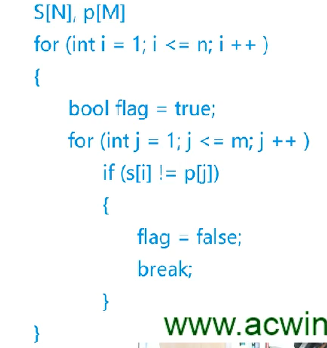

# 基础算法：KMP算法

### 给定一个文本串，一个模式串，找到模式串与文本串匹配的下标

#### 一般的暴力做法是用俩个指针，遍历俩个字符串，如下图

#### 

#### 这份暴力做法简单来说就是，如果发现不匹配的地方，马上退出循环，然后重新从i+1出开始遍历

#### 但是会造成很多时间的浪费O(m*n)，因为如果字符串A,B,当B中有重复片段匹配成功后，我们不用从i+1开始遍历，而是直接跳转到重复片段开始遍历，这样就简短了许多时间。


#### 由这个图可以看到，当俩字符串发生不匹配的时候（垂直的绿线），红线应该往后移动，暴力是只移动一位，而KMP算法移动到如同的位置，水平绿线的垂直方向的值都是相等的。什么情况可以这么做呢？字符串某部分前缀和和某部分后缀和的每一部分相等即可（当然前后缀和都相等也可以）。


#### 这里的红绿代表同一个字符串，绿色线是红线的一部分，next[i] = j的含义是：当字符串 p 以 i 为结尾的时候，前缀第 j 个和后缀 j 个是相等的，即 p[1~j] = p[i-j+1~i] ；

##### KMP的重点就是完成这个next数组，这个next数组就是由模式串产生的

- ## 

- ### 如图，如果next[1] = 0 ,也就是说 a 它本身，前缀和后缀是不能等于整个字符串的，所以是0，next[2] = 0, 此时是 a b ，a != b，所以也是0，next[3] = 1,此时发现，aba 的后缀 a = 前缀 a，但是前缀 ab != 后缀 ba ，所以是1，当next[4]时，abab的前缀ab 等于后缀 ab ，但是aba 不等于 bab ，所以next[4] = 2,以此类推，next[5]=3,next[6]=4,next[7]=5这是next数组的由来

``````c++
//输入字符串p，s，长度为n,m,数组next在代码中为ne
for(int i = 2;j = 0;i <= n ; i ++ ){//第一个值一定是0，所以从i=2开始
    while(j && p[i] != p[j + 1])j = ne[j];//这段代码拖到下面将
    if(p[i] == p[j + 1])j++; //如果p[i]正好等于p[j+1]，j++，这是在求当前ne[i]的值
    ne[i] = j;//求解当前ne值
}
``````

#### 	 `while(j && p[i] != p[j + 1])j = ne[j]`的意思是，当发现下一个字符匹配不上了，例如abac，当aba的时候是1，但是abac的时候，我们不需要重新求a,ab,aba,abac而且从原来的ne数组中得到前面匹配的值，也就是 j = ne[j],直接解出当前 j 的值。

````c++
//知道ne数组后我们就可以开始匹配过程了
for(int i = 1, j = 0; i <= m; i ++){
	while( j && s[i] != p[j + 1]) j = ne[j];
    if(s[i] == p[j+1])j++;
    if( j == n)
    {
		printf("%d ",i - n);
        j = ne[j];
    }
}
````

#### 	我们把 i 作为字符串 s 的指针，j 作为 字符串 p 的指针，（注意存储是用char[]，而且是从下标1开始存），当 j 还不是 0 ，而且 s 和 p 又不匹配的话 ， 我们用 ne数组开始跳，如果匹配了的话，j 就继续 j++，前面说到，n是 p 字符串的长度，所以 j == n 的时候，就是发现全部匹配的时候，我们就可以输出 i - n（ i 的时候匹配成功，减去n长度就是匹配成功位置的下标），同时开始下一步的匹配。
