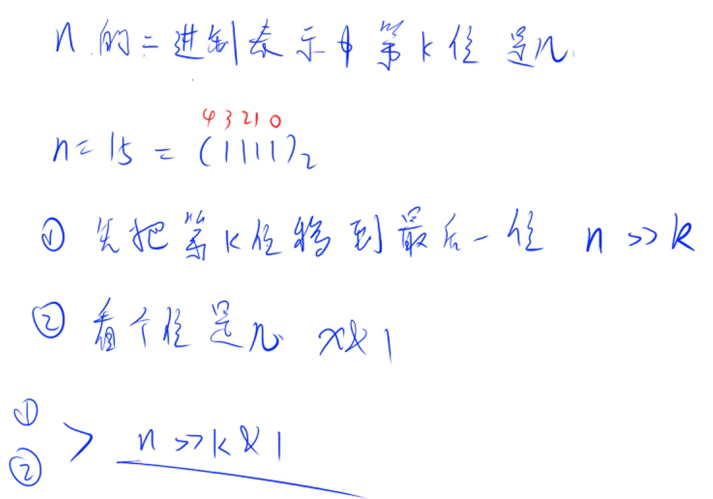
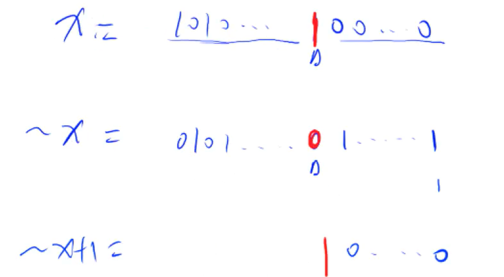

# 基础算法：位运算

- ## 查看一个数x二进制情况下的第k位（个位开始是第一位）

  1. #### 查看第k位操作：对x进行右移操作，右移k位 x >> k;再取个位 x & 1;答案就是  x >> k & 1;

     
  
     ​		[示例题](../luogu begineer/B2140.cpp)：比较一个数二进制后1和0的个数
  
  2. #### lowbit操作：查看x最后一个1，对x & -x即可
  
     1. ##### 原因：程序存储负数是对其正数取补码+1
  
        

###### 				这样只有最后一位1不一样，其它全部与原x一样，& 操作后就可以得到那位1