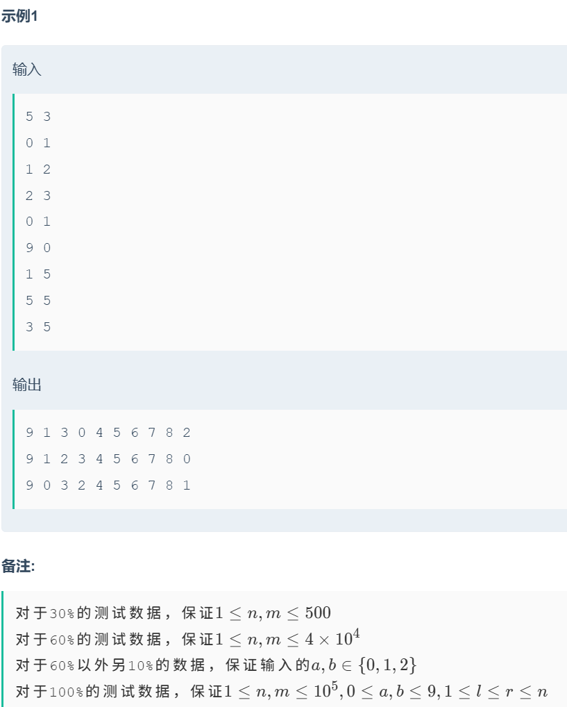

# 重温前缀和/差分

##### [题目来源](https://ac.nowcoder.com/acm/contest/19483)

# 前缀和

#### 前缀和数组: 元素Si表示[1,i]的影响累加

#### 前缀和是一种思想,从最简单的求区间和看起

### 给定一个数组,在O(1)时间内求出任意[l,r]的和

#### 简单来说,前缀和利用了累积可逆,我们得到[1,r]的和,多出了[1,l-1]的和,这段区间明显消去,也就是对加上[1,l-1]逆转

#### 原本产生的是加法+,逆转只需要减法即可-

## 故: 区间和为 [1,r] - [1,l-1]

#### 别看这道题很简单,累积可逆对前缀和非常重要.看下面这道题:

[牛牛的猜球游戏](https://ac.nowcoder.com/acm/contest/19483/F):

### 描述:




#### 题目简单明了,10个球排成一排,编号为0-9,存在n次,每次选择位置a,b的交换,问如果只执行[l,r]区间的操作,求最终排成一排的小球编号.

#### 如果对前缀和处于简单的理解,没能发现累积可逆,就可能在解题是放弃前缀和思想了.

#### 现在我们思考怎么让[1,l-1]可逆

#### 简单思考一下,假设小球有4个 . 1 2 3 4

#### swap(1,3): 3 2 1 4

#### swap(2,3): 3 1 2 4

#### swap(1,4): 4 1 2 3

#### 如果只想求swap(1,4)的影响怎么办?到底怎么消除[1,2]操作的影响???

#### [1,2]最终序列为 3 1 2 4,从1,2,3,4到这里经历了什么?操作1,2?不够具体,我们要求3 1 2 4的逆推序列

#### 假设 3 1 2 4还是原来的1 2 3 4(因为要求[l,r]的影响,初始是1 2 3 4,就好比求区间和[l,r],初始也是从0开始加).那么逆推序列就是 2 3  1 4(3到了第一个位置,所以假定的1跑到第3个位置....以此类推),事实上,逆推序列描述了[1,2]的累积影响

#### [1,3]最终序列为 4 1 2 3,要得到答案: 4 2 3 1,把它和逆推序列联系起来

1. #### 4 1 2 3

2. #### 2 3 1 4

#### 发现了什么?怎么才能到达 4 2 3 1 ?序列1中的第一个小球编号为4,序列2(逆推序列)中第4个为4,序列1中第二个小球编号为1,在序列2中第1个小球为2....最终,以序列1和序列2排成的序列为 4 2 3 1,这正是需要的答案.逆推序列真的把累积的影响消去了,这题真的可以用前缀和!!!如果是以前我肯定不懂,只知道显而易见的-是+的逆推,/是*的逆推....

```cpp
#include <bits/stdc++.h>
#define endl '\n'
using namespace std;
typedef long long LL;
typedef pair<int,int> PII;


const int INF = 1e9;


void solve()
{
    int n,m;cin>>n>>m;
    vector<vector<int>>rd(n+1,vector<int>(10));
    iota(rd[0].begin(),rd[0].end(),0);
    for(int i=1;i<=n;i++)
    {
        int a,b;cin>>a>>b;
        rd[i]=rd[i-1];
        swap(rd[i][a],rd[i][b]);
    }
    for(int i=1;i<=m;i++)
    {
        int l,r;cin>>l>>r;
        vector<int>tmp(10);
        for(int i=0;i<10;i++)
            tmp[rd[l-1][i]]=i;
        vector<int>ans(10);
        for(int i=0;i<10;i++)
            ans[i]=tmp[rd[r][i]];
        for(int i=0;i<10;i++)
            cout<<ans[i]<<' ';
        cout<<endl;
    }
}


int main()
{
    ios_base::sync_with_stdio(false);cin.tie(nullptr);cout.tie(nullptr);
    int T = 1;
    //cin>>T;
    while(T --)
    {
        solve();
    }
    return 0;
}
```

-------------

# 差分

#### 我们通常把差分当作一个在O(1)时间内修改区间的工具,查询则需要O(n)

#### 原数组的差分数组的前缀和就是原数组,可以说差分算是前缀和的逆了

#### 最经典的差分来自这样的题目,n个操作,每个操作在[l,r]区间加上或者减去一个数,求最终操作结束每个元素的值

#### 在差分数组中只需要在l处加上v(值),在r+1处减去v,就完成了[l,r]的区间修改,这也是最常见的应用,根据课程,我们看点不一样的.


#### 最初看到题目,最简单,直接,或者说暴力的想法就是贪心了,枚举每个高度,然后尽量让每次操作包含多的积木高度(连续区间尽可能大),很明显的,必然超时,时间复杂度是O(n*h),大约在1e9,肯定是无法接受的

#### 听说是经典差分题(虽然我没见过),那么考虑用用差分?

#### 我们主要的用时都在寻找区间中,差分怎么解决这道题的呢?其实很简单,直接对原数组差分,差分数组中正元素和等于负元素和,正元素和正是所需的最小操作次数.小小差分把点化作区间,完成了所有区间应有的合并,累加计数.代码异常简单:

```cpp
#include <bits/stdc++.h>
#define endl '\n'
using namespace std;
typedef long long LL;
typedef pair<int,int> PII;


const int INF = 1e9;


void solve()
{
    int n;cin>>n;
    vector<int>a(n+2);
    for(int i=1;i<=n;i++)
        cin>>a[i];
    vector<int>b(n+2,0);
    for(int i=1;i<=n;i++)
        b[i]+=a[i],b[i+1]-=a[i];
    int ans=0;
    for(int i=1;i<=n;i++)
        if(b[i]>0)
            ans+=b[i];
    cout<<ans<<endl;
    
}


int main()
{
    ios_base::sync_with_stdio(false);cin.tie(nullptr);cout.tie(nullptr);
    int T = 1;
    //cin>>T;
    while(T --)
    {
        solve();
    }
    return 0;
}
```

#### 这是什么原因?这道题原数组中的hi,都代表这个点要被多少连续的区间覆盖,把点化作区间,创建差分数组也完成了这段应该有多少个操作.

#### 深入差分,差分的差分意味着什么?假如有一个数组有5个元素,第一个元素是1.

#### 进行两次前缀和累加

####  1 0 0 0 0 -> 1 1 1 1 1 -> 1 2 3 4 5

#### 可以发现后面成了一个升序排列,这个排列有什么用呢?可以当作距离

#### 例题:


#### 如果暴力求解,应该是在O(n^2)的复杂度,明显会爆,如何解决呢?

#### 创建一个差差分数组,初始全为零

#### 每当我们在i遇到1,就在i+1的位置加1,太巧妙了,这个1完成了后续如果字符串中有可以连接的对象的时候,统计了后续所有的距离,完成这个数组后,做两遍前缀和,每次遇到1,ans就累加(记得取余),代码同样很简短:

```cpp
#include <bits/stdc++.h>
#define endl '\n'
using namespace std;
typedef long long LL;
typedef pair<int,int> PII;


const int INF = 1e9;
const int mod = 1e9+7;

void solve()
{
    int n;string s;cin>>n>>s;
    s=' '+s;
    vector<LL>b2(n+1);
    b2[0]=0;
    for(int i=1;i<=n;i++)
        if(s[i]=='1')
            b2[i+1]++;
    for(int i=1;i<=n;i++)
        b2[i]=b2[i]+b2[i-1]%mod;
    for(int i=1;i<=n;i++)
        b2[i]=(b2[i]+b2[i-1])%mod;
    LL ans=0;
    int flag=0;
    for(int i=1;i<=n;i++)
    {
        if(flag&&s[i]=='1')
            ans=(ans+b2[i])%mod;
        if(s[i]=='1')//第一个'1'跳过,这个'1'后面开始算
            flag=1;
    }
    cout<<ans<<endl;
}


int main()
{
    ios_base::sync_with_stdio(false);cin.tie(nullptr);cout.tie(nullptr);
    int T = 1;
    //cin>>T;
    while(T --)
    {
        solve();
    }
    return 0;
}
```

#### 离开这些天才的想法,回到差分的原本作用:`用常数的复杂度来改变区间`

#### 最简单应用就是在一次差分数组中改变两个元素从而记录整个区间的操作

#### 我们上一题很明显看到,除了最简单的让区间都加上1个数或者减去1个数,还可以用1个数用到二次差分数组上,表示让后续的数加上1,2,3,4,5....这种神奇的事.我们甚至可以搭配二次差分和一次差分,毕竟二次差分前缀和后就变成了一次.

### 例题:


#### 终于来了道能看出来是差分的题了!操作1,2我们都知道了,关键是操作3,这怎么办?

#### 我们分析, 1 4 9 16 25 36 ....

#### 差分: 1 3 5 7 9 .....不行,这样还是要修改n次

#### 再差分: 1 2 2 2 2.....还是不行,还是要修改n次,但是我们立马就可以看到,再次差分必然有希望!

#### 再再差分: 1 1 0 0.....除了最开始两个1,后面全是0!这意味着我们不需要修改后面的了,我们经过三次差分,用常数的修改表示了1,4,9...平方数序列的修改!!!

#### 代码如下:

```cpp
#include <bits/stdc++.h>
#define endl '\n'
using namespace std;
typedef long long LL;
typedef pair<int,int> PII;


const int INF = 1e9;
const int mod = 1e9+7;

void solve()
{
    int n,m;cin>>n>>m;
    vector<LL>b1(n+1,0),b2(n+1,0),b3(n+1,0),ans(n+1,0);
    for(int i=1;i<=m;i++)
    {
        int ty,pos;cin>>ty>>pos;
        if(ty==1)
            b1[pos]++;
        if(ty==2)
            b2[pos]++;
        if(ty==3)
        {
            b3[pos]++;
            if(pos+1<=n)//注意防越界
                b3[pos+1]++;
        }
            
    }
    for(int i=1;i<=n;i++)
    {
        b3[i]=(b3[i]+b3[i-1])%mod;
        b2[i]=(b2[i]+b2[i-1]+b3[i])%mod;
        b1[i]=(b1[i]+b1[i-1]+b2[i])%mod;
    }
    for(int i=1;i<=n;i++)
        cout<<b1[i]<<' ';
    cout<<endl;
}


int main()
{
    ios_base::sync_with_stdio(false);cin.tie(nullptr);cout.tie(nullptr);
    int T = 1;
    cin>>T;
    while(T --)
    {
        solve();
    }
    return 0;
}
```

#### 一个区间加上一个常数,加上1,2,3,4....,加上1,4,9,16....会不会有点特殊?有没有什么规律呢?怎么从特殊推广到一般呢?

#### 假设有个函数$f(x)=a_1x^k+a_2x^{k-1}+a_3x^{k-2}+\dots+a_{k+1}x^0$,这样要差分多少次才能变成常数修改呢?

### **`结论:对于最高项数为k的多项式,最多需要k+1次差分`**

#### 例题:


