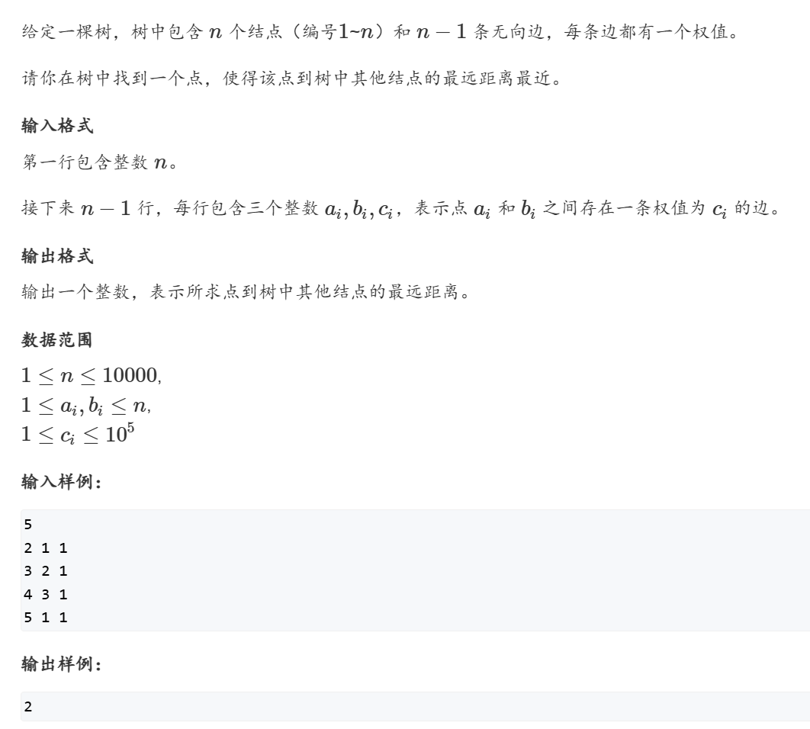

### 树形dp: 树的中心

[1073. 树的中心 - AcWing题库](https://www.acwing.com/problem/content/1075/)




#### 由于不知道根,暴力O(n^2)枚举所有点作为根节点,根据题意模拟;

```cpp
#include <iostream>
#include <cstring>
#include <algorithm>

using namespace std;

const int N = 10010, M = N << 1, INF = 0x3f3f3f3f;

int n;
int h[N], e[M], w[M], ne[M], idx;
int d1[N], d2[N];

void add(int a, int b, int c)
{
    e[idx] = b, w[idx] = c, ne[idx] = h[a], h[a] = idx ++ ;
}
int dfs(int u, int father)
{
    d1[u] = d2[u] = 0;
    for (int i = h[u]; ~i; i = ne[i])
    {
        int j = e[i];
        if (j == father) continue;
        int dist = dfs(j, u) + w[i];
        if (dist >= d1[u]) d2[u] = d1[u], d1[u] = dist;
        else if (dist > d2[u]) d2[u] = dist;
    }
    return d1[u];
}
int main()
{
    memset(h, -1, sizeof h);
    scanf("%d", &n);
    for (int i = 1; i < n; i ++ )
    {
        int a, b, c;
        scanf("%d%d%d", &a, &b, &c);
        add(a, b, c), add(b, a, c);
    }

    int res = INF;
    for (int i = 1; i <= n; i ++ ) res = min(res, dfs(i, -1));
    printf("%d\n", res);
    return 0;
}
```

#### 换根dp 写法O(n)

[AcWing 1073. 树的中心【树形DP+换根DP】 - AcWing](https://www.acwing.com/solution/content/65263/)

#### 假定一个点为根,从根开始找到一条最长的路径.

#### u(当前点)

#### 不仅仅需要知道从u到子节点的路线最长距离,还需要知道从u到父节点路线的最长距离.

#### 但是下面的树形dp只用了2次dfs就完成了这题,说明肯定在一次dfs就处理了上面的问题

#### 但是发现dfs1函数只是求了子节点到u的最长路和次长路.

#### 只知道最长路和次长路的情况下,怎么求得答案的解?

1. #### 首先是从u到子节点,这就是f[u]\[0],dfs1中直接求得的

2. #### 从u到父路线的最长路怎么来呢?

- #### 由于知道了f[fa]\[0]和f[fa]\[1],看fa的最长路(来自子节点)是否包含u,如果包含u,那只能用次长路,因为简单路径不能是回头路.

- #### s1数组很好的记录了最长路来着哪个节点,我们可以通过s1数组来判断子节点是否在u的最长路上

3. #### 最后,枚举所有向下和向上的路径,求最短值即可

```cpp
#include <iostream>
#include <cstring>
#include <algorithm>

using namespace std;

const int N = 10010, M = N << 1, INF = 0x3f3f3f3f;

int n;
int h[N], e[M], w[M], ne[M], idx;
int d1[N], d2[N], up[N];
int s1[N], s2[N];

void add(int a, int b, int c)
{
    e[idx] = b, w[idx] = c, ne[idx] = h[a], h[a] = idx ++ ;
}
void dfs1(int u, int father)
{
    // d1[u] = d2[u] = -INF;  //这题所有边权都是正的，可以不用初始化为负无穷
    for (int i = h[u]; ~i; i = ne[i])
    {
        int j = e[i];
        if (j == father) continue;
        dfs1(j, u);
        if (d1[j] + w[i] >= d1[u])
        {
            d2[u] = d1[u], s2[u] = s1[u];
            d1[u] = d1[j] + w[i], s1[u] = j;
        }
        else if (d1[j] + w[i] > d2[u])
        {
            d2[u] = d1[j] + w[i], s2[u] = j; // s2记录了次短路来源,但事实上本题不需要
        }
    }
    // if (d1[u] == -INF) d1[u] = d2[u] = 0; //特判叶子结点
}
void dfs2(int u, int father)
{
    for (int i = h[u]; ~i; i = ne[i])
    {
        int j = e[i];
        if (j == father) continue;
        if (s1[u] == j) up[j] = w[i] + max(up[u], d2[u]);   //son_u  = j，则用次大更新
        else up[j] = w[i] + max(up[u], d1[u]);              //son_u != j，则用最大更新
        dfs2(j, u);
    }
}
int main()
{
    memset(h, -1, sizeof h);
    scanf("%d", &n);
    for (int i = 1; i < n; i ++ )
    {
        int a, b, c;
        scanf("%d%d%d", &a, &b, &c);
        add(a, b, c), add(b, a, c);
    }
    dfs1(1, -1);
    dfs2(1, -1);
    int res = INF;
    for (int i = 1; i <= n; i ++ ) res = min(res, max(d1[i], up[i]));
    printf("%d\n", res);
    return 0;
}

```

### 子节点是否可以被最长路和次长路均包含?

#### 然而这个思考是不成立的,因为s1的定义是: 来着 s1[u] 的最长路,s2的定义是:来自s2[u]的最长路,我们操作的时候,只是通过逻辑让 s1[u] 是来自最长路的那个节点, s2[u]是来自次长路的你个节点